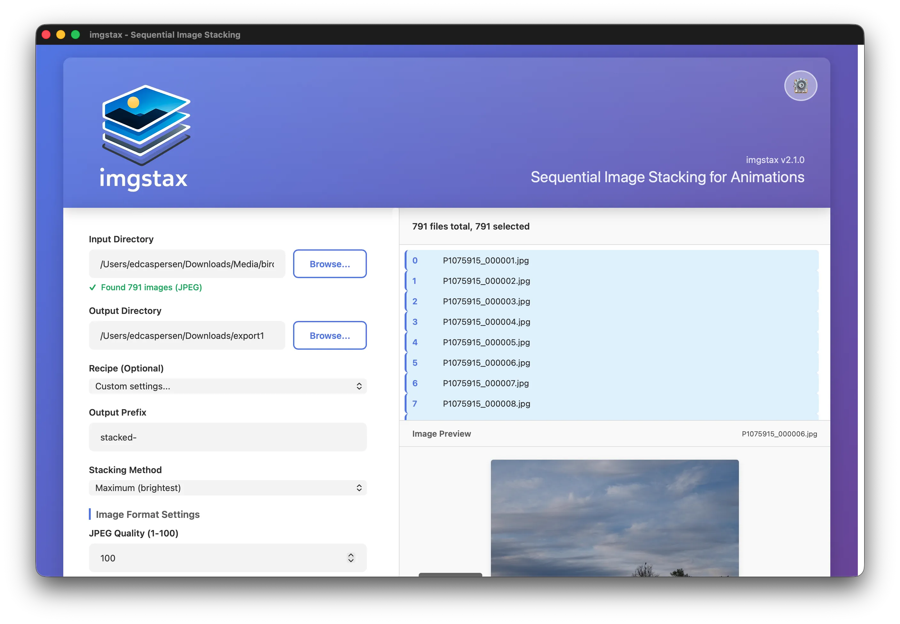
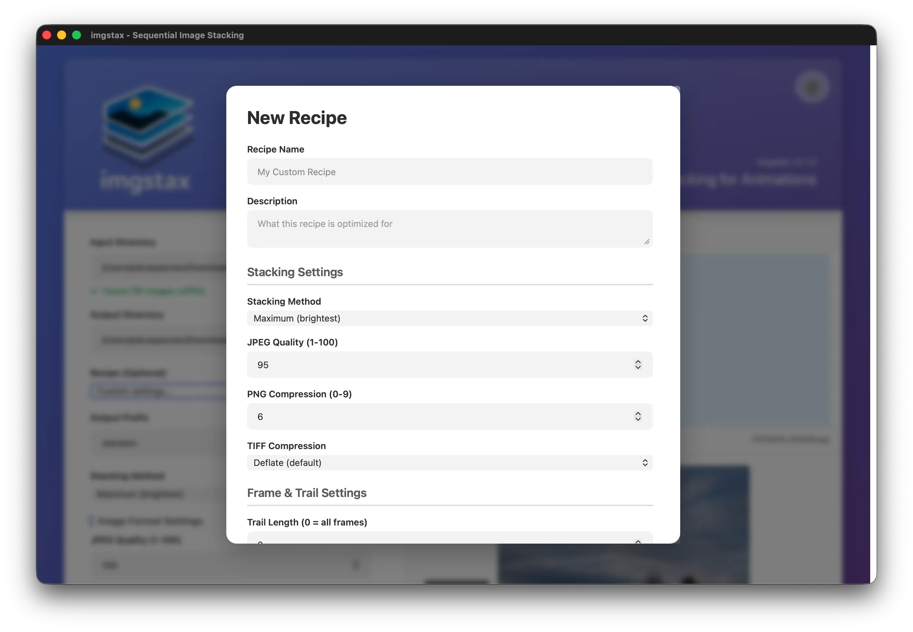
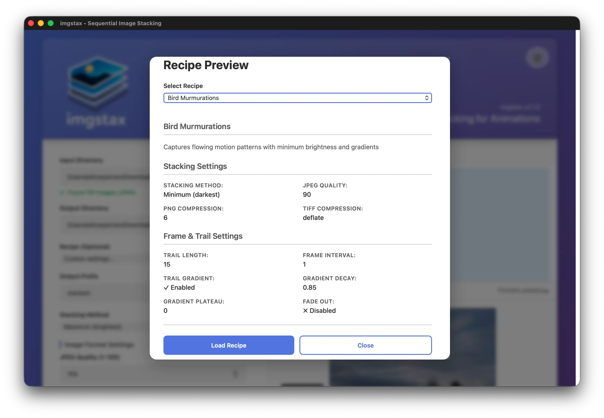
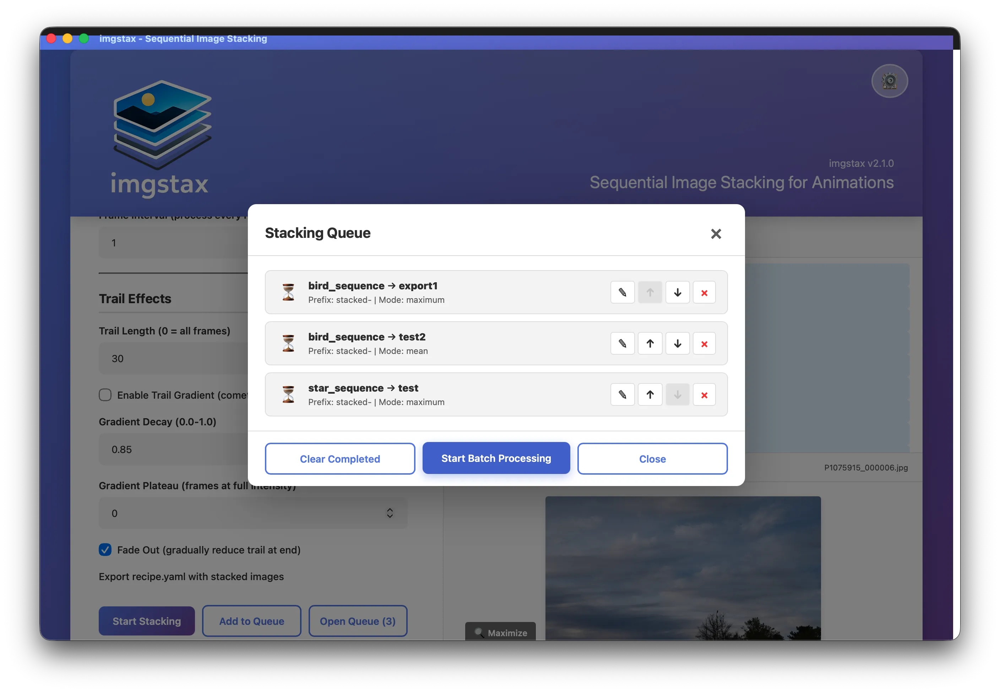
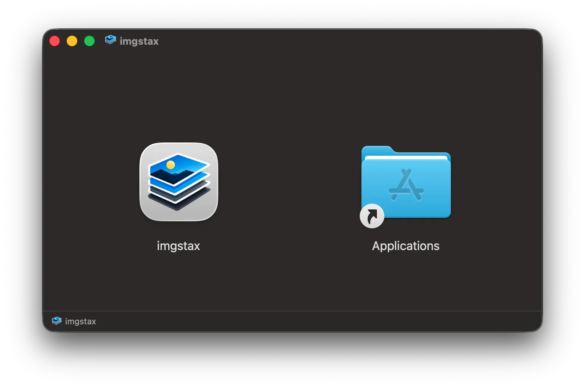
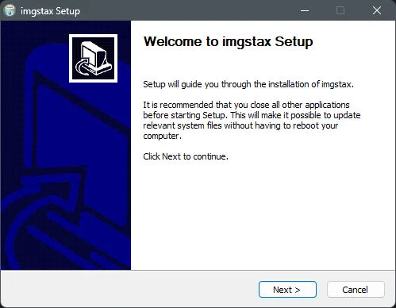
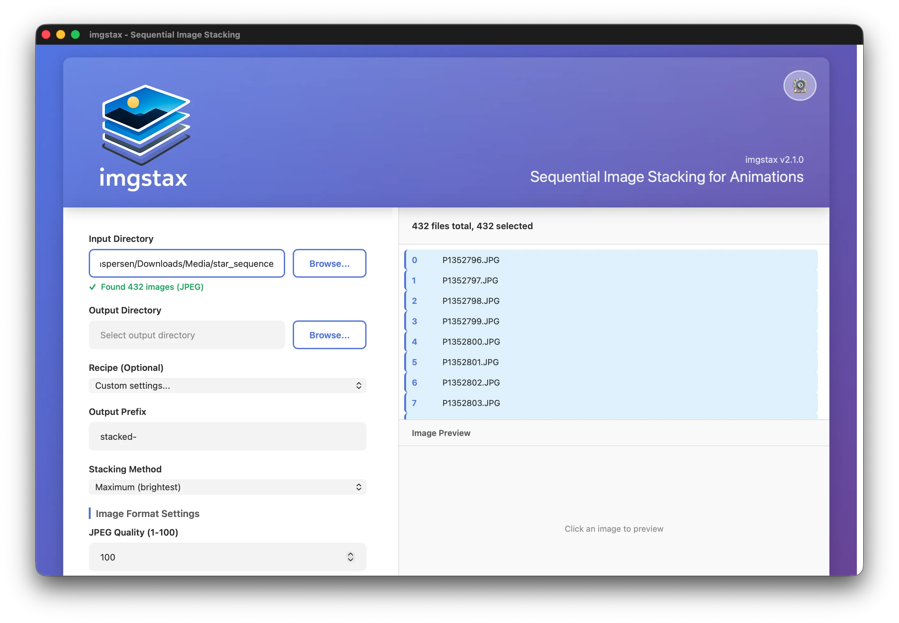
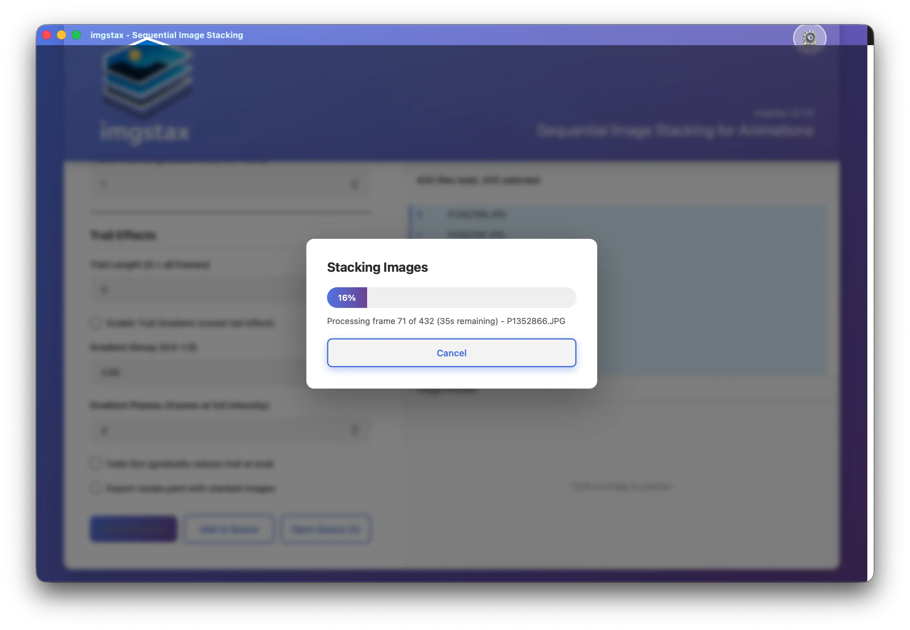
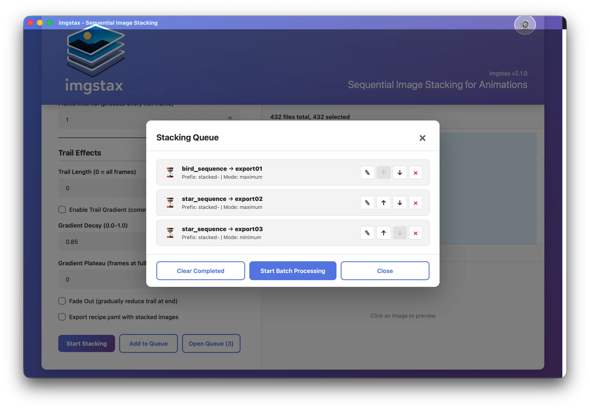
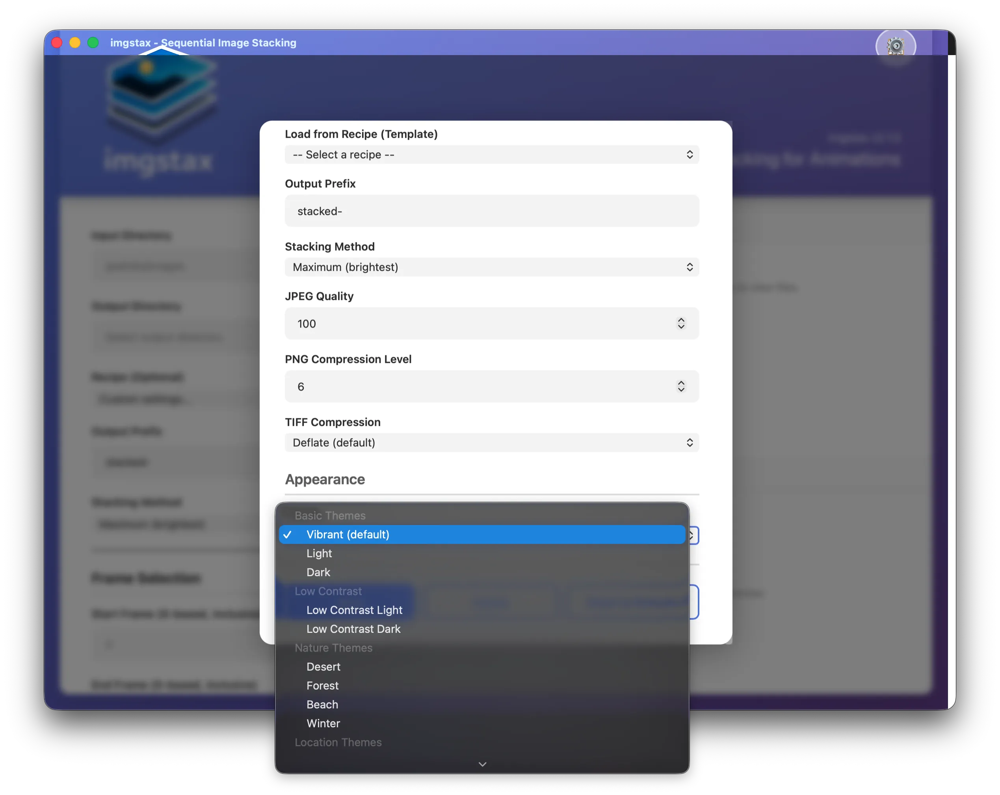

# imgstax Desktop - Sequential Image Stacking for Animations

Create stunning **animated progressions** from image sequences with an intuitive desktop interface. imgstax Desktop processes sequential frames (from timelapse or video) to generate frame-by-frame stacked outputs, perfect for star trail animations, time-lapse effects, and visualizing motion over time.

**What imgstax does:** Progressive stacking of sequential frames to create animations
**What imgstax doesn't do:** Complex single-image stacking with calibration frames (use [StarStax](https://markus-enzweiler.de/software/starstax/), Photoshop, or Affinity Photo instead)

---

## Download

### Latest Release (v2.1.0)

- **macOS** (Apple Silicon): [Download DMG](https://github.com/repsac/imgstax/releases/latest)
- **Windows** (x64): [Download MSI](https://github.com/repsac/imgstax/releases/latest)
- **Linux**: [Build from source](CONTRIBUTING.md) (see [Building](#building-from-source) below)

### System Requirements

- **macOS**: 11.0 (Big Sur) or later, Apple Silicon (M1/M2/M3/M4)
  - Intel Macs can run via Rosetta 2 (performance may vary)
- **Windows**: Windows 10 (64-bit) or later
- **Disk Space**: ~100 MB

No Python installation required for pre-built applications!

---

## Features

### Visual Interface

- **File Browser with Preview**: Browse directories and preview images before processing
- **Real-time Progress**: Watch your stacks build with live progress and ETA
- **Batch Queue System**: Add multiple jobs and process them sequentially
- **Recipe System**: Built-in presets for stars, traffic, murmurations, and more
- **12 Color Themes**: Choose from Light, Dark, Desert, Forest, Utah, Yosemite, and more



### Recipe Editor

Create and manage custom recipes for your workflows:

- Create new recipes with custom settings
- Edit existing user recipes
- Preview all built-in and user recipes
- Export recipes to share with others
- Import recipes from YAML files





### Batch Processing Queue

Process multiple stacking jobs efficiently:

- Add jobs to queue without clearing your current settings
- Reorder jobs with drag-and-drop or up/down buttons
- View status (pending, processing, completed, failed)
- Re-queue completed jobs for re-processing
- Export recipe with each batch export



### Stacking Algorithms

- **Maximum**: Star trails, light trails, fireworks
- **Minimum**: Bird murmurations, dark objects in motion
- **Mean**: Noise reduction, smooth motion blur
- **Median**: Remove transient objects

### Advanced Options

- **Trail Gradient**: Comet tail effect with progressive fade
- **Trail Length**: Sliding window for moving effects
- **Fade Out**: Graceful trail termination
- **Frame Selection**: Start, end, and interval controls
- **Format Options**: JPEG quality, PNG compression, TIFF compression
- **Dry Run**: Test settings without creating files

---

## Quick Start

### 1. Download and Install

**macOS**:
1. Download the `.dmg` file from [Releases](https://github.com/repsac/imgstax/releases/latest)
2. Open the DMG and drag imgstax to Applications
3. **First launch only:** The app may be blocked by macOS Gatekeeper. To unblock:
   - Open Terminal
   - Type: `sudo xattr -rd com.apple.quarantine` (don't press Enter yet)
   - Drag imgstax.app from Applications into Terminal (adds the path)
   - Press Enter and enter your password when prompted

   *Note: Right-click → Open sometimes works but is not always reliable.*



**Windows**:
1. Download the `.msi` installer from [Releases](https://github.com/repsac/imgstax/releases/latest)
2. Run the installer and follow the prompts
3. Launch imgstax from the Start Menu



### 2. Select Your Images

1. Click "Browse..." next to Input Directory
2. Navigate to your image sequence folder
3. Preview images in the file browser on the left



### 3. Choose a Recipe (Optional)

Select from built-in presets:
- **Stars**: Star trails with gradient (30-frame trail)
- **Traffic**: Vehicle light trails (20-frame trail)
- **Murmurations**: Dark objects in motion (15-frame trail)
- **Timelapse**: Motion blur effects (5-frame trail)
- **Fireworks**: Firework composites (10-frame trail)
- **Noise Reduction**: Averaging for clean images

Or manually configure stacking mode, trail length, and other parameters.

### 4. Set Output Directory

Choose where your stacked images will be saved. Each export creates a timestamped directory with:
- Stacked image sequence
- `metadata.json` with settings used
- `recipe.yaml` (if "Export recipe" is checked)

### 5. Stack Images

**Single Export**: Click "Stack Images" to process immediately

**Batch Processing**:
1. Click "Add to Queue" to add the job
2. Adjust settings and add more jobs
3. Click "Open Queue" → "Start Batch Processing"



---

## Using Recipes

### Built-in Recipes

| Recipe | Stacking | Trail | Gradient | Best For |
|--------|----------|-------|----------|----------|
| **stars** | maximum | 30 | Yes | Star trails, astrophotography |
| **murmurations** | minimum | 15 | Yes | Bird flocks, dark objects in motion |
| **traffic** | maximum | 20 | Yes | Vehicle light trails |
| **timelapse** | mean | 5 | No | Time-lapse with motion blur |
| **fireworks** | maximum | 10 | No | Firework composites |
| **noise-reduction** | mean | 0 | No | Noise reduction averaging |

### Creating Custom Recipes

1. Select "✎ Recipe Editor" from the recipe dropdown
2. Fill in the recipe details:
   - **Name**: Short descriptive name
   - **Description**: What this recipe is for
   - **Stacking Mode**: Algorithm to use
   - **Trail Length**: Number of frames to stack
   - **Gradient**: Enable comet tail effect
   - **Other parameters**: Quality, fade out, etc.
3. Click "Save Recipe"

Your custom recipes appear in the dropdown with "(User)" suffix.

### Recipe Storage

User recipes are stored in OS-appropriate locations:
- **macOS**: `~/Library/Application Support/imgstax-desktop/user_recipes/`
- **Windows**: `%APPDATA%/imgstax-desktop/user_recipes/`
- **Linux**: `~/.config/imgstax-desktop/user_recipes/`

Recipes are YAML files compatible with the [CLI version](README-CLI.md).

---

## Batch Processing Workflow

The queue system enables efficient batch processing:

### Adding Jobs to Queue

1. Configure your stacking parameters
2. Click "Add to Queue"
3. Output directory is cleared, but other settings remain
4. Adjust output directory and click "Add to Queue" again
5. Repeat for all your batch jobs

### Managing the Queue

- **Reorder**: Use ↑ ↓ buttons to change processing order
- **Remove**: Click × to remove a job (except currently processing)
- **Re-queue**: Completed jobs can be re-queued for reprocessing
- **Clear Completed**: Remove all completed/failed/cancelled jobs

### Processing the Queue

1. Click "Open Queue" to review your jobs
2. Click "Start Batch Processing"
3. Each job processes sequentially with progress shown
4. Cancel current job or entire queue during processing



---

## Themes

imgstax Desktop includes 12 built-in themes:

- **Light & Dark**: Classic high-contrast modes
- **Desert**: Warm earth tones
- **Forest**: Cool natural greens
- **Utah**: Burnt orange and red rock colors
- **Yosemite**: Sierra Nevada-inspired palette
- And 6 more...

Access themes from the ☰ menu → Theme.



---

## Tips & Best Practices

### Star Trail Photography

1. Use the **stars** recipe as a starting point
2. Enable **Trail Gradient** for smooth comet tails
3. Set **Trail Length** to 20-40 frames depending on rotation speed
4. Use **Maximum** stacking mode

### Traffic Light Trails

1. Use the **traffic** recipe
2. Enable **Trail Gradient** for realistic light decay
3. Set **Trail Length** to 15-25 frames
4. Adjust **Quality** to 90-95 for final exports

### Bird Murmurations or Swarms

1. Use the **murmurations** recipe
2. **Minimum** stacking mode isolates dark objects
3. Enable **Trail Gradient** for natural motion blur
4. Set **Trail Length** to match movement speed

### Time-Lapse Effects

1. Use the **timelapse** recipe
2. **Mean** stacking creates smooth motion blur
3. Short **Trail Length** (3-7 frames) for subtle blur
4. Disable **Gradient** for even distribution

---

## Supported Image Formats

- **JPEG** (.jpg, .jpeg) - Adjustable quality (1-100)
- **PNG** (.png) - Adjustable compression (0-9)
- **TIFF** (.tif, .tiff) - Multiple compression options (none, lzw, deflate, jpeg)

All images in a sequence must have the same dimensions.

---

## Command-Line Interface

Power users can access the full CLI:

```bash
imgstax /path/to/images -o output -s maximum -t 30 -g
```

See [CLI Documentation](README-CLI.md) for complete command-line usage, programmatic API, and advanced options.

---

## Building from Source

### Prerequisites

- **macOS**: Xcode Command Line Tools, Rust, Node.js
- **Windows**: Visual Studio Build Tools, Rust, Node.js
- **Linux**: WebKit2GTK, build-essential, Rust, Node.js

### Development Mode

```bash
# Clone the repository
git clone https://github.com/repsac/imgstax.git
cd imgstax

# Install Python dependencies
pip install -e .

# Run the desktop app in dev mode
cd desktop-app
npm install
npm run tauri dev
```

### Production Build

```bash
# Build the Python binary
python build_binary.py

# Build the desktop app
cd desktop-app
npm run tauri build
```

See [CONTRIBUTING.md](CONTRIBUTING.md) for detailed setup instructions and [BUILD.md](BUILD.md) for complete build documentation.

---

## Performance & Troubleshooting

### Performance Tips

- **Image Size**: Smaller images (1920x1080) process faster than 4K
- **Trail Length**: Shorter trails use less memory
- **Batch Processing**: Process overnight for large queues
- **Dry Run**: Test settings without creating files first

### Common Issues

**"Image dimension mismatch" error**
- All images must have identical dimensions
- Check for different aspect ratios or resolutions
- Remove any non-image files from input directory

**App won't open on macOS**
- Right-click → Open (first launch only)
- Go to System Settings → Privacy & Security to allow
- macOS Gatekeeper blocks unsigned apps by default

**Windows Defender warning**
- Click "More info" → "Run anyway"
- The app is safe but not code-signed (yet)
- You can submit false positive reports to Microsoft

**Out of memory errors**
- Use shorter trail lengths (`-t` parameter)
- Process in batches using start/stop frame selection
- Close other applications to free RAM

**Progress not showing/app frozen**
- Large images take time per frame
- Check activity monitor/task manager for CPU usage
- App is likely processing normally

---

## Use Cases

### Perfect for imgstax Desktop

- ✅ Star trail **animations** (progressive stacking over time)
- ✅ Traffic light trail **sequences**
- ✅ Time-lapse **effects** with motion accumulation
- ✅ Bird murmuration **progressions**
- ✅ Firework **sequences**
- ✅ Long exposure **simulations** from video frames

### Better Tools for Other Tasks

- ❌ **Single-frame perfection** with calibration → Use [StarStax](https://markus-enzweiler.de/software/starstax/), Photoshop, or Affinity Photo
- ❌ **Deep sky astrophotography** with dark/flat/bias frames → Use DeepSkyStacker or PixInsight
- ❌ **Video editing** or effects → Use DaVinci Resolve, Premiere, or Final Cut Pro

imgstax focuses on **progressive sequential stacking for animations**, not single-image perfection.

---

## Version History

### v2.1.0 (Current)
- **Desktop GUI Application**: Native macOS and Windows support
- **File Browser**: Visual directory browsing with image preview
- **Recipe Editor**: Create and manage custom recipes
- **Batch Queue System**: Process multiple jobs sequentially
- **12 Color Themes**: Customizable interface
- **Recipe System**: YAML-based presets (stars, traffic, murmurations, etc.)
- **Trail Gradient**: Comet tail effect with exponential decay
- **Enhanced Progress**: ETA and current filename display

### v2.0.0
- Complete modular refactor
- Type hints and pathlib support
- Progress bars (tqdm)
- Quality control options
- Image validation

### v1.0.0
- Initial CLI release

---

## Contributing

Contributions welcome! Areas for development:

**In Scope:**
- Additional stacking algorithms
- Performance optimizations
- UI/UX improvements
- Recipe templates for new use cases
- Cross-platform bug fixes

**Out of Scope:**
- Calibration frame support (dark/flat/bias frames)
- Image alignment/registration
- Single-image workflows
- Video codec implementation

See [CONTRIBUTING.md](CONTRIBUTING.md) for development setup.

---

## License

MIT License - see [LICENSE](LICENSE) file for details

---

## Links

- **GitHub**: [github.com/repsac/imgstax](https://github.com/repsac/imgstax)
- **CLI Documentation**: [README-CLI.md](README-CLI.md)
- **Build Guide**: [BUILD.md](BUILD.md)
- **Contributing**: [CONTRIBUTING.md](CONTRIBUTING.md)
- **Releases**: [github.com/repsac/imgstax/releases](https://github.com/repsac/imgstax/releases)

---

## Author

Ed Caspersen

## Acknowledgments

- **Tauri**: For the amazing desktop app framework
- **NumPy**: Array operations and stacking algorithms
- **Pillow**: Image processing
- **PyYAML**: Recipe system
- **tqdm**: Progress visualization

---

## Support & Donations

While I appreciate the thought of direct donations, I'd much rather see support go to these wonderful animal rescue organizations:

- **[Funky Chicken Rescue](https://funkychickenrescue.com/donate)** - Rescuing and rehabilitating chickens and other farm birds
- **[LTWC Wildlife Center](https://ltwc.org/donate)** - Wildlife rehabilitation and conservation
- **[Suisun Wildlife Center](https://www.suisunwildlife.org)** - Wildlife rescue and environmental education
- **[H Branch Donkey Rescue](https://www.hbranchdonkeyrescue.com)** - Sanctuary for rescued donkeys
- **[Rancho Burro Donkey Sanctuary](https://ranchoburrodonkeysanctuary.org)** - Safe haven for abandoned and neglected donkeys

These organizations do incredible work helping animals in need. If imgstax has been useful to you, please consider supporting them.
